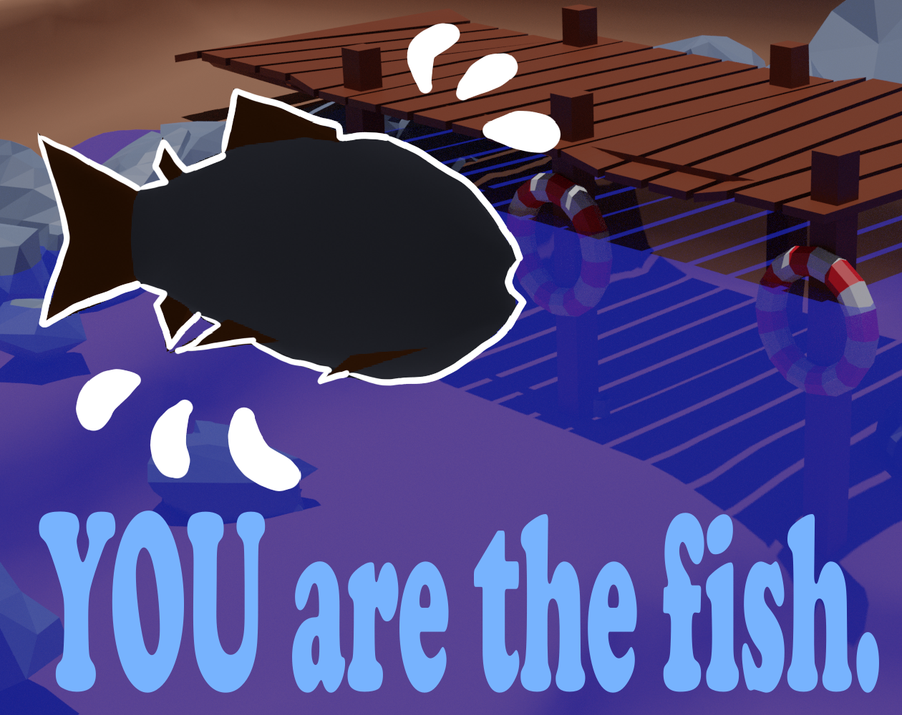
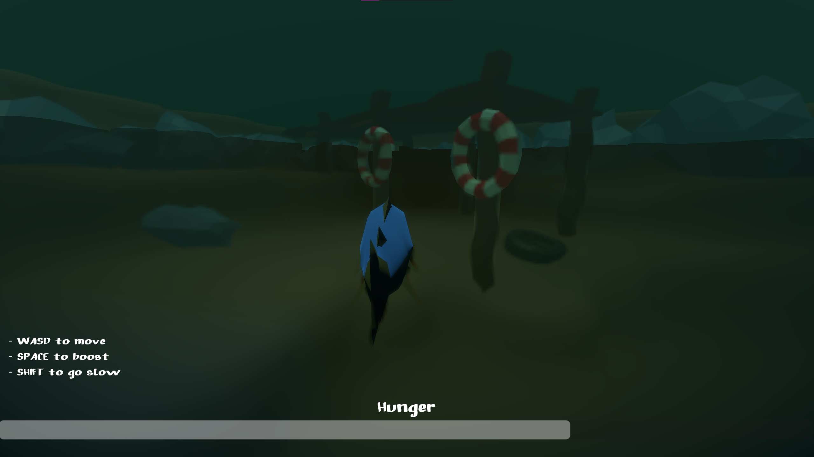

# YOU are the Fish

 

This game was developed for [GMTK 2023 Game Jam](https://itch.io/jam/gmtk-2023). My entry is called 'YOU are the Fish' which you can [play on itch.io](https://sirlich.itch.io/you-are-the-fish), or [rate](https://itch.io/jam/gmtk-2023/rate/2158967).

## Explanation

This game parodies the fishing minigame genera, by allowing you to play as a fish. Your goal is to explore a murky pond, and steal fish from the AIs fishing rods, which triggers a quick-time event. The game was developed in Godot 4.1, and I spent the vast majority of the time learning, creating, and polishing the murky underwater effect, which was created entirely in a single post-process shader.

## Credits

### Assets
 - Font: Big Moka by lirkiv
 - Fish Model (no animations): Kenny

### Software
 - Blender 3.4
 - Godot 4.1
 - Audacity
 - Krita